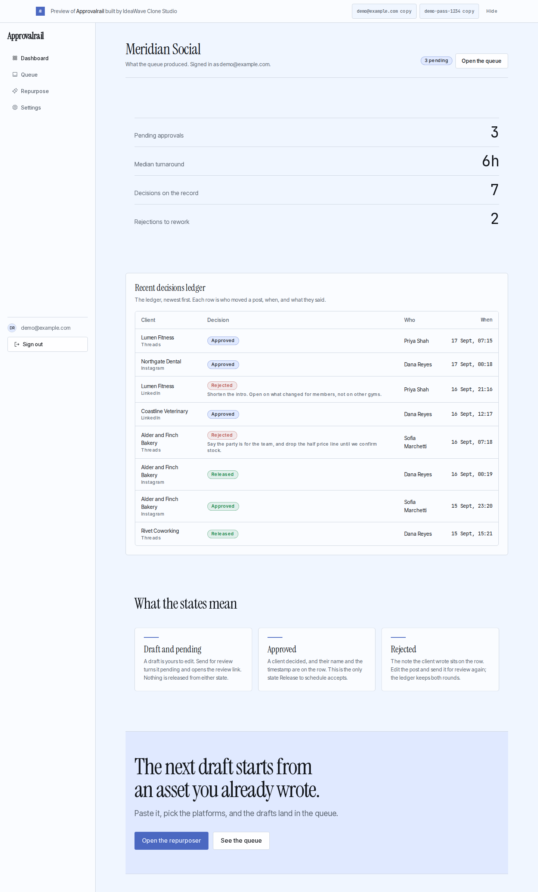
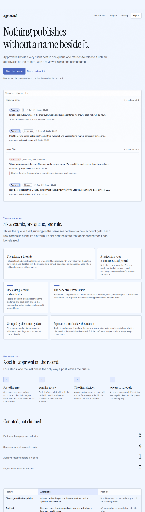
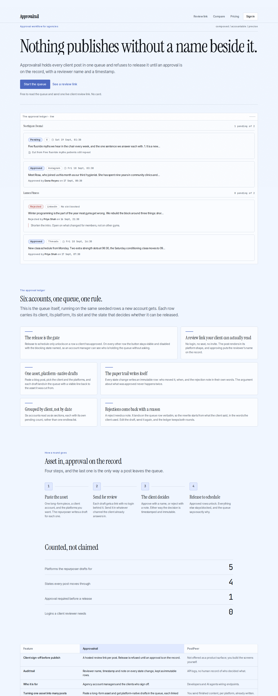
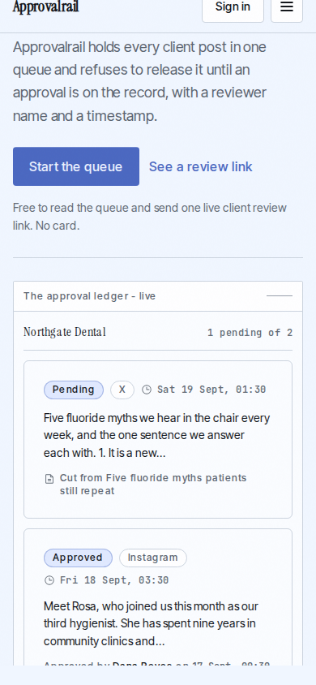
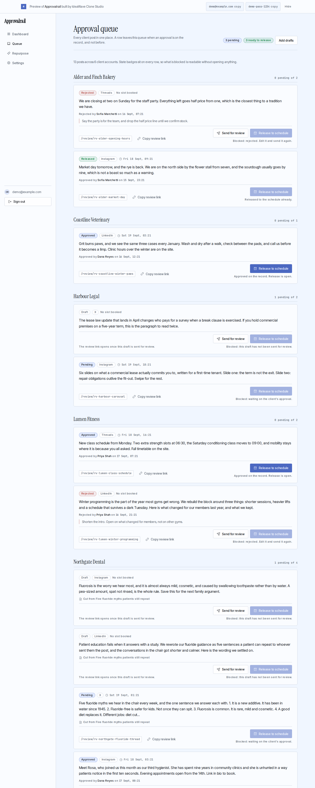
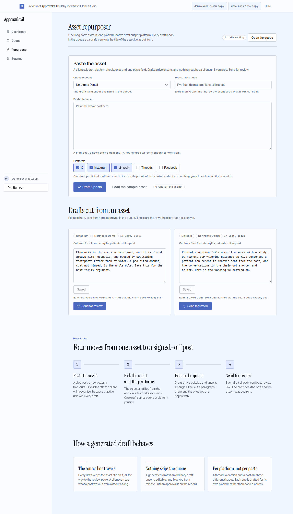
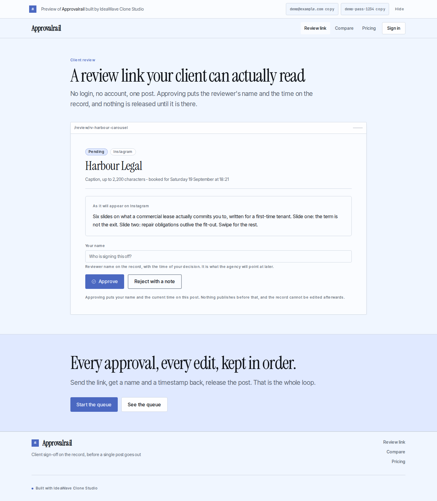

# Approvalrail

Built by IdeaWave Clone Studio from a proven market (source: https://ideawave.io/startup/postpeer). This repo is yours: MIT licensed, production-ready on the reference stack (Next.js App Router, Prisma 7 + Neon, Better Auth, Stripe, Resend, Tailwind v4).

Built in 36 minutes in the editorial art direction.

## What it does

- **Approval Queue** - `/queue`
  The release action stays visibly disabled with the exact blocking state named, never silently hidden.
- **Client Review Link** - `/review`
  The page renders the post in its platform shape and states plainly that approving puts the reviewer's name on the record.
- **Asset Repurposer** - `/repurpose`
  Every generated draft keeps a visible line back to the source asset title, so the client sees what it was cut from.

## Screenshots









## Quick start

```
cp .env.example .env   # paste a Neon DATABASE_URL and a BETTER_AUTH_SECRET
npm install
npx prisma migrate deploy
npm run dev
```

## The AI features

Approvalrail calls models through the Vercel AI Gateway. The live preview runs on a key IdeaWave minted for it with a hard $2 budget, and that key is not in this repository. To run the AI features yourself, put your own gateway key in `.env` as `AI_GATEWAY_API_KEY` and pick a model with `AI_MODEL`. Without a key the app still runs: every AI surface degrades to a notice instead of failing.

## Continue in your agent

- Claude Code: `git clone` this repo (or unzip it), `cd` into it and run `claude`. It reads CLAUDE.md, then SPEC.md and TODO.md, and continues from the build order.
- Cursor: open the folder; the same CLAUDE.md conventions apply.
- Push to GitHub to enable one-click deploy to Vercel and one-click import into Replit, Bolt and StackBlitz.

## What is in here

- SPEC.md: the product specification the agent built from.
- BRAND.md: the brand identity, its palette, its type and its voice.
- BUILD_ORDER.md: what is done and what is next.
- BUILD_REPORT.md: the agent's own report and the build numbers.
- TODO.md: the remaining work, in order.
- screenshots/: what the final design audit saw.

Live preview: https://clone-approvalrail.vercel.app (expires 2026-09-24)
